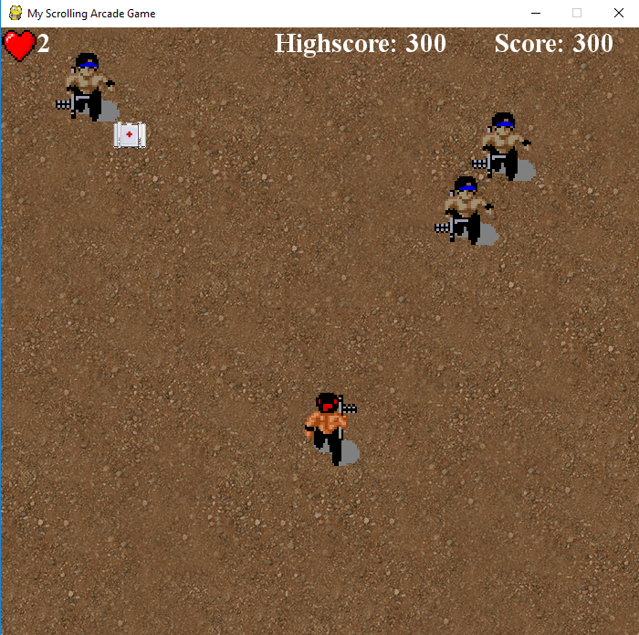

# Shooting_Scroller
A vertical shooting scroller game in [python-pygame](https://www.pygame.org/news).This project was made for fun, and is not intended for commercial use.
The sprites can be found [here](https://www.spriters-resource.com/arcade/ikariwarriors/sheet/27197/)

---


## Installation
1) Download Python's latest version [here](https://www.python.org/)
2) Download Pygame's latest version [here](https://www.pygame.org/news)
3) Clone this repository: ```git clone https://github.com/gzalos/Shooting_Scroller ``` or click ```Download Zip``` on top right
4) Run ```My Scrolling Arcade Game.py```

(Note: This project was made on Python 3.7 and Pygame 1.9.8)
---
## Controllers
Arrow Keys - Move

Space      - Shoot

1,2,3      - Difficulty

Return     - Main Menu

---
## Screenshot

